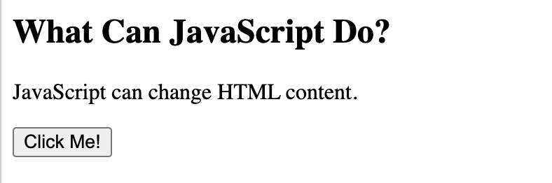

# JavaScript

JavaScript is the world's most popular programming language.

JavaScript is the programming language of the Web.

You can place any number of scripts in an HTML document.

Scripts can be placed in the `<body>`, or in the `<head>` section of an HTML page, or in both.


JavaScript accepts both double and single quotes.

```
<!DOCTYPE html>
<html>
<body>

<h2>JavaScript</h2>

<button type="button"
onclick="document.getElementById('demo').innerHTML = Date()">
Click me to display Date and Time.</button>

<p id="demo"></p>

</body>
</html> 
```

One of many JavaScript HTML methods is getElementById().


```
<!DOCTYPE html>
<html>
<body>

<h2>What Can JavaScript Do?</h2>

<p id="demo">JavaScript can change HTML content.</p>

<button type="button" onclick='document.getElementById("demo").innerHTML = "JavaScript!"'>Click Me!</button>

</body>
</html>
```



