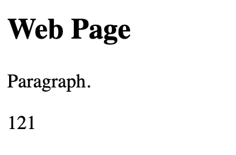
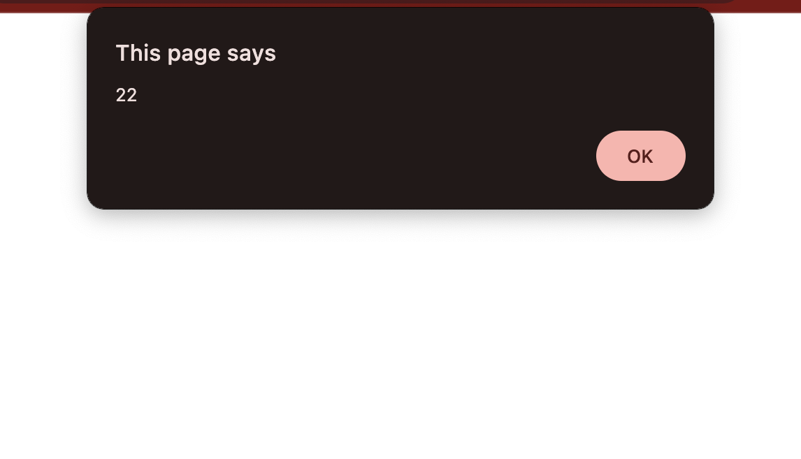
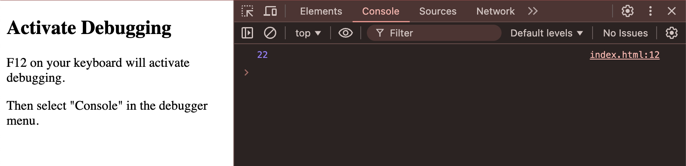

# JavaScript Output

JavaScript output refers to the various ways in which JavaScript code can display information to the user or developer.

- Writing into an HTML element, using `innerHTML`.
- Writing into the HTML output using `document.write()`.
- Writing into an alert box, using `window.alert()`.
- Writing into the browser console, using `console.log()`.

## innerHTML

To access an HTML element, JavaScript can use the `document.getElementById(id)` method.

The id attribute defines the HTML element. The `innerHTML` property defines the HTML content:

```
<!DOCTYPE html>
<html>
<body>

<h2>Web Page</h2>
<p>Paragraph.</p>

<p id="demo"></p>

<script>
document.getElementById("demo").innerHTML = 55 + 66;
</script>

</body>
</html> 
```


## document.write()

## Using document.write() after an HTML document is loaded, will delete all existing HTML. The document.write() method should only be used for testing!

```
<!DOCTYPE html>
<html>
<body>

<h2>Web Page</h2>
<p>Paragraph.</p>

<p>Never call document.write after the document has finished loading.
It will overwrite the whole document.</p>

<script>
document.write(5 + 6);
</script>

</body>
</html> 
```

## window.alert()

```
<!DOCTYPE html>
<html>
<body>

<h1>Web Page</h1>
<p>Paragraph.</p>

<script>
window.alert(11 + 11);
</script>

</body>
</html>
```


The window object is the global scope object. This means that variables, properties, and methods by default belong to the window object. Specifying the window keyword is optional:

```
<script>
alert(11 + 11);
</script>
```

## console.log()

```
!DOCTYPE html>
<html>
<body>

<h2>Activate Debugging</h2>

<p>F12 on your keyboard will activate debugging.</p>
<p>Then select "Console" in the debugger menu.</p>


<script>
console.log(11 + 11);
</script>

</body>
</html> 
```



## Print

Call the window.print() method in the browser to print the content of the current window.

```
<!DOCTYPE html>
<html>
<body>

<h2>The window.print() Method</h2>

<p>Click the button to print the current page.</p>

<button onclick="window.print()">Print this page</button>

</body>
</html>
```

