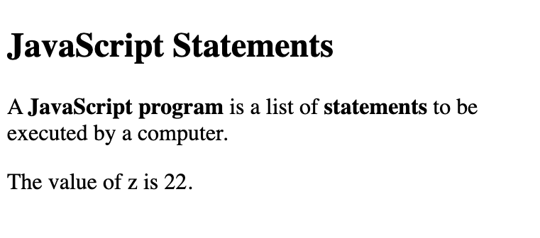
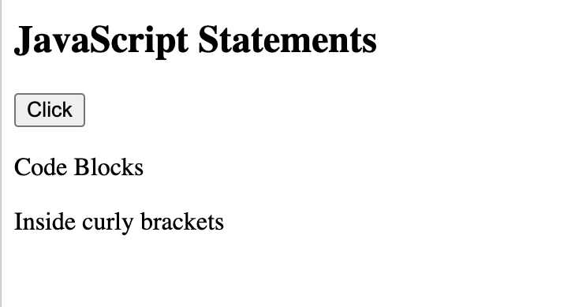

# JavaScript Statements



```
<!DOCTYPE html>
<html>
<body>

<h2>JavaScript Statements</h2>

<p>A <b>JavaScript program</b> is a list of <b>statements</b> to be executed by a computer.</p>

<p id="demo"></p>

<script>
let x, y, z;  // Statement 1
x = 11;        // Statement 2
y = 11;        // Statement 3
z = x + y;    // Statement 4

document.getElementById("demo").innerHTML =
"The value of z is " + z + ".";  
</script>

</body>
</html>
```

JavaScript statements are composed of values, operators, expressions, keywords, and comments.

The statements are executed, one by one, in the same order as they are written.

Statement tells the browser to write "Whatever you want" inside an HTML element with id="demo":

```
<!DOCTYPE html>
<html>
<body>

<h2>JavaScript Statements</h2>

<p>In HTML, JavaScript statements are executed by the browser.</p>

<p id="demo"></p>

<script>
document.getElementById("demo").innerHTML = "Whatever you want.";
</script>

</body>
</html>
```

## Semicolons ;

Semicolons separate JavaScript statements.

```
<script>
let a, b, c;
a = 5;
b = 6;
c = a + b;
document.getElementById("demo1").innerHTML = c;
</script>
```
When separated by semicolons, multiple statements on one line are allowed:

```
<script>
let a, b, c;
a = 5; b = 6; c = a + b;
document.getElementById("demo1").innerHTML = c;
</script>
```
Ending statements with semicolon is not required, but highly recommended.

## White Space

Add white space to your script to make it more readable.

```
let person = "White Space";
let person="White Space";
```

A good practice is to put spaces around operators ( = + - * / ):

```
let x = y + z;
```

## Line Length and Line Breaks

Avoid code lines longer than 80 characters.

If a JavaScript statement does not fit on one line, the best place to break it is after an operator

```
<!DOCTYPE html>
<html>
<body>

<h2>JavaScript Statements</h2>

<p>
The best place to break a code line is after an operator or a comma.
</p>

<p id="demo"></p>

<script>
document.getElementById("demo").innerHTML =
"Line Length and Line Breaks";
</script>

</body>
</html>
```

## Code Blocks

The purpose of code blocks is to define statements to be executed together.

```
<!DOCTYPE html>
<html>
<body>

<h2>JavaScript Statements</h2>

<button type="button" onclick="myFunction()">Click</button>

<p id="demo1"></p>
<p id="demo2"></p>

<script>
function myFunction() {
  document.getElementById("demo1").innerHTML = "Code Blocks";
  document.getElementById("demo2").innerHTML = "Inside curly brackets ";
}
</script>

</body>
</html>
```


